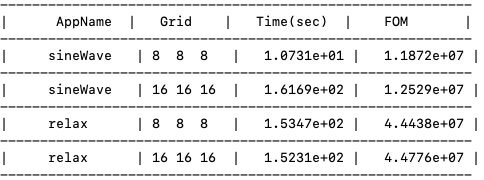

# ALCF-4 Thornado Benchmark

This is the ALCF-4 benchmark for the neutrino-transportation simulation codebase Thornado. This document describes obtaining the Thornado benchmark on heterogeneous systems for ALCF-4. The general ALCF-4 benchmark run rules apply except where explicitly modified in this document and should be reviewed before running this benchmark.

## Thornado Overview

Thornado models the transport of neutrinos and their interaction with matter. Since neutrinos couple weakly with matter, a kinetic description based on the Boltzmann equation is warranted. However, to manage computational costs, Thornado approximates the neutrino radiation field by solving for angular moments of the kinetic distribution function in a multi-species spectral two-moment approach. Thornado uses the discontinuous Galerkin (DG) method to discretize the moment equations in phase-space. After discretization with the DG method, the moment equations reduce to a system of ordinary differential equations (ODEs) that consists of the transport operator models the free-streaming of neutrinos in phase-space, and the collision operator models interactions between neutrinos and matter. Implicit-Explicit (IMEX) methods are used to integrate the ODE forward in time. Here, the transport operator is integrated with an explicit method, while the collision operator is integrated with an implicit method.  

The performance of the algorithms implemented in Thornado can be considered with two representative tests: Streaming Sine Wave (SSW) and Relaxation.  The SSW test solves the scheme that consists of the transport operator only using a two-stage Runge-Kutta time integration method,  The Relaxation test solves the scheme that includes the collision operator, using the backward Euler method. The large number of unknowns and their coupling makes the neutrino transport solve computationally demanding, and efficient use of HPC systems is essential. 

Thornado provides modules to Flash-X that can be used to simulate multi-physics applications and it is a compute-intensive part of Flash-X, specifically consuming 80% FLOPs for seller-explosion simulation.

Thornado is a Fortran code, accelerated by OpenACC and OpenMP directives to utilize GPUs or multi-core CPUs. The code leverages vendor-optimized linear algebra libraries (e.g., LAPACK, OneMKL, cuBLAS, rocBLAS). Thornado is primarily a single MPI rank code that can be executed on a GPU. However, it can be used in a modular way to independently evolve regions of a physical domain, such as those provided by the domain-decomposition in an adaptive mesh refinement framework of a multi-physics application (e.g., Flash-X).

## Code Access

The required Thornado version used for this benchmark, commit #f1a7244de1bc07024405022e7f92e777d60264a7 from the GitHub repository at https://github.com/endeve/thornado/tree/develop is provided with this benchmark distribution. 

### Thornado configuration used in Aurora benchmark

### FOM

FOM for the each app, SSW and Relaxation can be computed using the following equation,
```zsh
FOM_app = DOF * Number_of_Time_steps/ IMEX_Time 

where, 
DOF is the number of degrees of freedom of the phase-space discretization, that can be computed as follows, 
DOF = nE * nSpecies * nMoments * nNodes^(d+1) * nX^d 
nE - number of energy elements
nSpecies -  number of neutrino species
nMoments - number of moments
nNodes -  number of quadrature nodes
d -  dimensions 
nX -  grid points per dimension
```

### Software prerequisites

* HDF5 portable I/O library downloadable from http://www.hdfgroup.org/HDF5/ 
* weaklib-table from ORNL. source: git clone https://code.ornl.gov/astro/weaklib-tables.git @ af807da4767ec7eaa43f4f652f2fc48157499742
* weaklib from https://github.com/starkiller-astro/weaklib.git (be a submodule possibly?)
* BLAS/LAPACK, numerical, and linear algebra libraries. Use platform-optimized libraries where available

### Building
```zsh
tar -xzf Thornado-ALCF_4-ref.tar.gz 
cd thornado/benchmark/{sys}

 sys - on which system/site, e.g. ‘sunspot.alcf.anl’
```

### Building Thornado manually 

#### Set root directory and directories for the tools
```zsh
export EXASTAR_HOME=${PWD}
export THORNADO_DIR=${EXASTAR_HOME}/thornado
export WEAKLIB_DIR=${EXASTAR_HOME}/weaklib
export WEAKLIB_TABLES_DIR=${EXASTAR_HOME}/weaklib-tables
export HDF5_INC=${HDF5_ROOT}/include
export HDF5_LIB=${HDF5_ROOT}/lib
```

#### link weaklib tables
```zsh
ln -s $WEAKLIB_TABLES_DIR/SFHo/LowRes/wl-Op-SFHo-15-25-50-E40-B85-AbEm.h5
ln -s $WEAKLIB_TABLES_DIR/SFHo/LowRes/wl-Op-SFHo-15-25-50-E40-B85-Iso.h5
ln -s $WEAKLIB_TABLES_DIR/SFHo/LowRes/wl-Op-SFHo-15-25-50-E40-B85-NES.h5
ln -s $WEAKLIB_TABLES_DIR/SFHo/LowRes/wl-Op-SFHo-15-25-50-E40-B85-Pair.h5
ln -s $WEAKLIB_TABLES_DIR/SFHo/LowRes/wl-Op-SFHo-15-25-50-E40-HR98-Brem.h5
ln -s $WEAKLIB_TABLES_DIR/SFHo/LowRes/wl-EOS-SFHo-15-25-50.h5
```

####  Building on which system
```zsh
export THORNADO_MACHINE=sunspot.alcf.anl
```
#### Set system-specific environment variables - this is for Intel-PVC systems
```zsh
export IGC_OverrideOCLMaxParamSize=4096
```
#### Building for which applicsation,  APP_NAME is set to ‘ApplicationDriver’ for the app SSW and ‘ApplicationDriver_Neutrinos’ for the app Relaxation.
```zsh
export APP_NAME=ApplicationDriver
mkdir ../Output
make -j 8 {conf}
```
 conf -  with which configuration/parameters, e.g. ‘USE_OMP_OL=TRUE’
 #### Example make for the system sunspot.alcf.anl using OpenMP target offloading and OneMKL
```zsh
make -f ${THORNADO_DIR}/Makefile $APP_NAME USE_OMP_OL=TRUE USE_GPU=TRUE USE_CUDA=FALSE USE_ONEMKL=TRUE
```

### Building Thornado using proveided scripts

Simply, use the provided build scripts, build.{app}.sh
app -  for which app. e.g. ‘ssw’

### Testing The Build

This test validates the results based on the order of numerical error obtained for each nutirno species.
```zsh
test -<all> | {app}
app -  for which app. e.g. ‘ssw’ 
```

### Running the benchmark

As described above, two test-apps SSW and Relaxation can be evaluated for various systems. The batch scripts for the various systems are provided in their own-named directories in the benchmark directory. Within the respective directory build the apps manually or using the appropriate scripts, and and run the benchmarks using the benchmark script (e.g bench_sunspot.sh). The script runs both apps for two spatial resolutions 8×8×8 and 16×16×16 and collects IMEX_Time and FOM. For each app and each test-data, the execution also can be manually performed using the following way,
```zsh
export LD_LIBRARY_PATH=${HDF5_LIB}:$LD_LIBRARY_PATH
export LIBOMPTARGET_PLUGIN=LEVEL0
export EnableImplicitScaling=0
export ZE_AFFINITY_MASK=0.0
export OMP_TARGET_OFFLOAD=MANDATORY
export OMP_NUM_THREADS=1
ulimit -s unlimited
export LIBOMPTARGET_LEVEL_ZERO_MEMORY_POOL=device,256,128,32768
./${APP_NAME}_${THORNADO_MACHINE} 16 16 16  
```

### Results

Sample IMEX_Time and FOM collected for the apps with two spatial resolutions 8×8×8 and 16×16×16 using the bench_sunspot.sh script is shown below,




